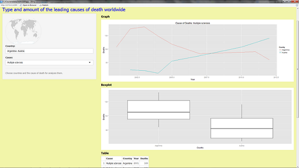
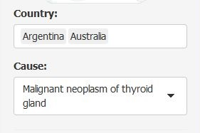
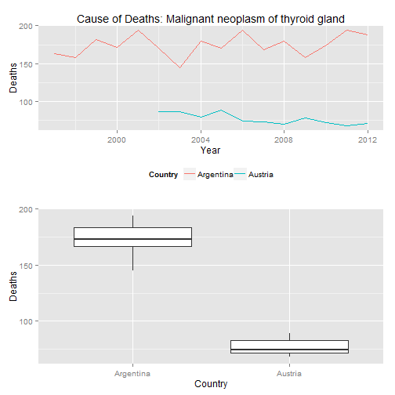

<style>
.center {
    text-align:center;
}
.reveal h1, .reveal h2, .reveal h3 {
  word-wrap: normal;
  -moz-hyphens: none;
  text-align:center;
}
.font {
  font-size: 14px;
}
.small-code pre code {
  font-size: 14px;
}
</style>


Type and amount of the leading causes of death worldwide  
========================================================
<div class="center">
An application that facilitates the analysis of data on causes of deaths in the comparison between countries
<p></p>

</div>
Domingos Savio Apolonio Santos, 04/18/2015

Overview
========================================================

The app use a subset of the data from the World Health Organization (WHO) with the following features:

- The app allows the user to select cause of death and countries for analysis.
- The panel shows a line chart, a blox plot, and the table with the subset of data.
<div class="center">

</div>

Inputs
========================================================

- The user can select one or more countries and one cause of deaths from a list:

<div class="center">

</div>

- The app creates a subset of data with the parameters selected:

```r
temp =  subset(morticd10, Country == input$country  & Cause == input$cause)
```
 


Outputs
========================================================
class: small-code
After the user selects the countries and cause, the application plots the line graph with the data  from selected countries, and a respective boxplot. The application also shows the respective table with the subset of the data.


```r
subset <- read.csv("subset.csv")
library(ggplot2); library(gridExtra)
p1 <- qplot(Year, Deaths, data = subset, color=Country, geom = "line", 
    main = paste0("Cause of Deaths: ", subset$Cause[1])[1]) + theme(legend.position = "bottom")  
p2 <- ggplot(subset, aes(x = Country, y = Deaths)) + geom_boxplot() 
grid.arrange(p1, p2, ncol = 1)
```

 

Final Comments
========================================================
- The source data do not have information for all causes and  years for some countries. Then, it was necessary to apply some filters to get the maximum of complete information.
- It is necessary to improve the steps for the data transformation and cleaning to get more causes and countries.
- It plans to  sdd an input to provide prediction functionalities (How many deaths may occur in a given year?).


